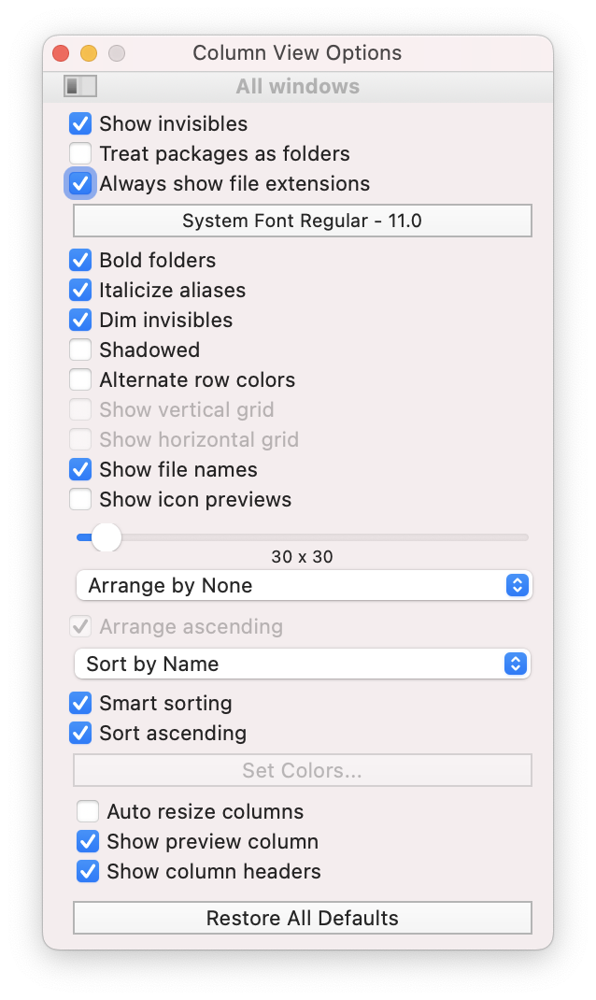
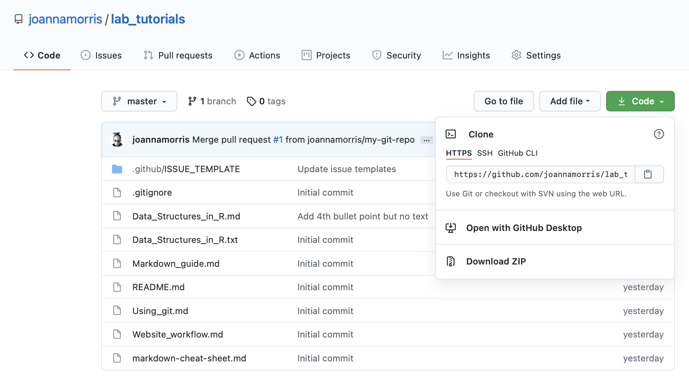

# Installing  git

1. Install git

2. Sign up for a GitHub account

3. In your computer's **file browser** ensure that you can see:
  - **Invisible files and folders** (On the Mac these start with a period e.g. `.git`)

  - **File extensions** (This is the part of the filename at the *end* after a period. For example in the filename `test.doc`  the extension is `.doc`)

  

  - Many of the files that git needs to function are files that begin with a period which are **invisible files** on the Mac OS (operating system).

# The GitHub Workflow for Repos that you don't own

1. Workflow:  fork, clone, edit, commit, push, pull request

  - Start by **forking** (made an individual copy of) the  repo to your github.com account.

  - Now, you should **clone** the forked repo, i.e.g make a copy of it on your local computer.

  - You can then **edit** the files in your local copy of the repo and **commit** the changes.

  - You can then **push** those changes back up to your forked repo on github.com.

  - Finally, you can make a **pull request**
to update the central repository with our changes.

2. Cloning a repository from GitHub

  - A repository on GitHub exists as a **remote repository**.

  - To work on the files on your own computer, you should **clone** the repository which will create a local copy on your computer.  

  - To clone a repository, first find the **URL** for the repository on GitHub

  

  - In the terminal, navigate to the **directory** on your computer to which you want to  copy the repository e.g `cd ~/my_git_repos`

  - Once in that directory,  type `git clone https: [your_repository]`.  For example `git clone https://github.com/joannamorris/lab_tutorials.git`

3. A note on 'forking' vs 'cloning'

  - A **fork** is a copy of a repository that is on your GitHub account, as opposed to the account of the original repository owner.

  - When you 'fork' a repository, you clone a **remote** copy of the repository on your GitHub account.

  - You can then make another clone of the forked repository on your local computer.

  - When you edit files in the cloned repository  (on your local computer), you can **push** (or upload) the changes to the forked repository on your GitHub account.

  - These changes to the forked repository can be merged with the original repository via a **pull request** which is a request to the original the repository owner to merge your changes with (or **pull** your changes into) the original repository.

   - Summary of the steps to editing files in a github repositories that you don't onw:

    - ***Step 1***: **Fork** a repository to your_repository own GitHub account.

    - ***Step 2***: **Clone** the repository to your local machine.

    - ***Step 3***: Edit the files and **commit** these edits to the local repository. You can apply a single commit or multiple commits to the repository. But everything happens on your local system.

    - ***Step 4***: **Push** the modifications to the upstream repository on your account (the fork).

    - ***Step 5***: Send a request to the owner of the original repository to merge (pull) the changes into the main central repository.  This is a **pull request**.

# Linking local and remote repositories

   - Using the terminal, The `remote` command shows which remote repositories are currently connected to your local repository. It also allows you to add new connections or remove existing ones.

   - Each connection to your local repository has a *name* and a *URL*.

  - When you **clone** a repository, the command automatically adds that **remote repository** under the name `origin`.

  - When you **fork** a repository,  it's good practice to regularly sync your fork with the **upstream repository**. Otherwise, changes made to the original repository will not be propagated down to the copy on your GitHub account (the fork) or the clone of the fork on your local compute   r.

  - You must configure a remote that points to the upstream repository in Git to sync changes you make in a fork with the original repository. This also allows you to sync changes made in the original repository with the fork.

  - To summarise, you should connect the **fork** on your GitHub account to the original repository, and connect your local clone of the fork to *both* the fork and the upstream original repo.

  - Recall that when you cloned the repository on your computer, the `git clone` command automatically added (linked) a remote repository called 'origin'.

  - You should now add  *another* link to the original upstream repo called 'upstream' that will allow you to pull changes from the original repo
`$ git remote add upstream https://github.com/ORIGINAL_OWNER/ORIGINAL_REPOSITORY.git`

## The git commands `fetch`, `pull`, `merge`, `push` and `sync`

    - The command `git fetch origin` **fetches** any new work that has been **pushed** to that server since you **cloned** (or last **fetched** from) it.

    - The `git fetch` command only downloads the data to your local repository.

    - If I want get changes from the remote repository called `origin` into my local repository I type `git fetch origin`.

    - It doesn’t automatically merge it with any of your work or modify what you’re currently working on. You have to merge it manually into your work when you’re ready.

    - the `git pull` command is a `git fetch` command followed by a `git merge` command.

    - Git sync does everything in one command meaning pull and push read here

# Branching

     - To view the branches in a Git repository, run the command `git branch`

     - To see both local and remote branches use `git branch -a` or `git branch --all`

     - To see details of each brach use `git branch -v` or `git brach --verbose`

     -

     - `git checkout -b BRANCH_NAME` creates a new branch and checks out the new branch

     - `git branch BRANCH_NAME` creates a new branch but leaves you on the same branch.

     - In other words `git checkout -b BRANCH_NAME` does the following for you:

       `git branch BRANCH_NAME    # create a new branch`
       `git switch BRANCH_NAME    # then switch to the new branch`
